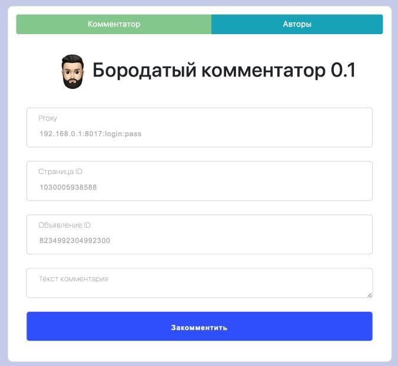

# commentsFB
**Добавляем комменты к рекламной записи ФБ через API**

**Установка:** 

- Добавляем данные базы данных в файле `/includes/config.php`
- Чтобы обновлять акки-авторов через прокси в файле: `/function/getStatusToken.php`
- Импортируем файл `comments.sql` в базу данных

Пока не придумал как сделать без этого))

На этом всё установка завершена!
